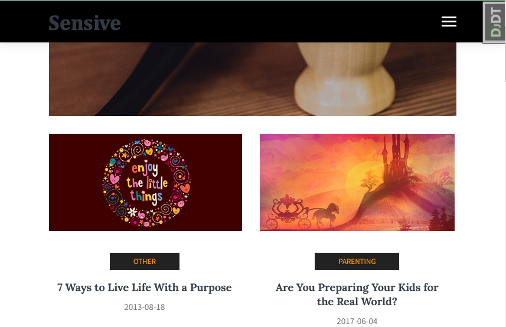

# Django blog optimization

Django-based website.



## Prerequisites

Python 3.11 is required.

## Installing

- Download the project files.
- It is recommended to use [venv](https://docs.python.org/3/library/venv.html?highlight=venv#module-venv) for project isolation.
- Set up packages:

```bash
pip install -r requirements.txt
```

Create SQLite database:

```bash
python manage.py migrate
```

- Set up environmental variables in your operating system or in the .env file. The variables are:

  - `DEBUG` (optional, `True` by default)
  - `SECRET_KEY` (optional, `REPLACE_ME` by default)
  - `ALLOWED_HOSTS` (obligatory when `DEBUG` is set to `False`)
  - `DATABASE` - database address (optional, `sqlite:///db.sqlite3` by default), see [also](https://github.com/jacobian/dj-database-url)

To set up variables in .env file, create it in the root directory of the project and fill it up like this:

```bash
DEBUG=True
SECRET_KEY=REPLACE_ME
ALLOWED_HOSTS=localhost,127.0.0.1
DATABASE=sqlite:///db.sqlite3
```

- Create a superuser:

```bash
python manage.py createsuperuser
```

## Using

- Run a development server:

```bash
python manage.py runserver
```

- Go to [the admin site](http://127.0.0.1:8000/admin/) and fill the base;
- Go to [the site main page](http://127.0.0.1:8000/).

## Project goals

The project was created for educational purposes.
It's a lesson for python and web developers at [Devman](https://dvmn.org).
